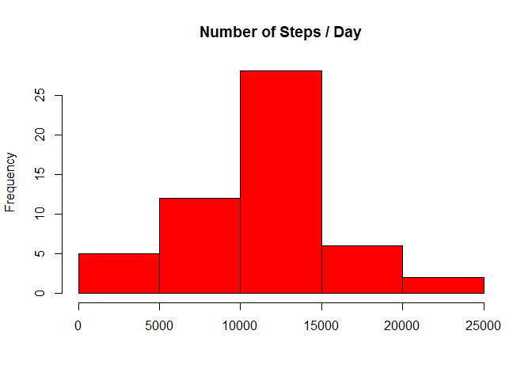
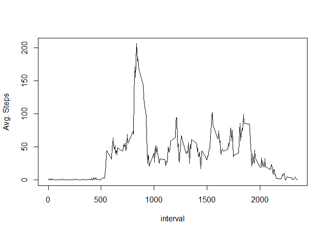
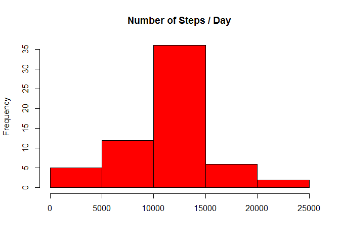

# Reproducible Research: Peer Assessment 1

```r
 options(scipen = 1, digits = 0)
```

#Loading and preprocessing the data

```r
act1 <- read.csv("activity.csv")
act1$date <- as.Date(act1$date,"%Y-%m-%d")
```
# What is mean total number of steps taken per day?

## 1.Calculate the total number of steps taken per day

```r
library(data.table)
dtAct1 <- data.table(act1)
dtAct2 <- dtAct1[complete.cases(dtAct1),list(sum=sum(steps),mean=mean(steps),median=median(steps)),by=date]
```

## 2.Make a histogram of the total number of steps taken each day


```r
hist(as.numeric(dtAct2$sum),main="Number of Steps / Day",  xlab="",col="red")
```

 

## 3. Calculate and report the mean and median of the total number of steps taken per day


```r
meanTotalStepsPerDay <- round(mean(dtAct2$sum),digits = 0)
medianTotalStepsPerDay <- round(median(dtAct2$sum),digits = 0)
```

Mean total number of steps taken per day are 10766 and median is 10765

# What is the average daily activity pattern?
## 1.Make a time series plot (i.e. type = "l") of the 5-minute interval (x-axis) and the average number of steps taken, averaged across all days (y-axis)


```r
dtAct3 <- dtAct1[complete.cases(dtAct1),list(sum=sum(steps),avgSteps=mean(steps),median=median(steps)),by=interval]

with(dtAct3,plot(interval,avgSteps,type="l", ylab="Avg. Steps"))
```

 

## 2.Which 5-minute interval, on average across all the days in the dataset, contains the maximum number of steps?


```r
maxInt <- dtAct3[which.max(dtAct3$avgSteps), interval]
```

on average across all the days in the dataset, the interval with maximum number of steps is: 835

# Imputing missing values
## 1.Calculate and report the total number of missing values in the dataset (i.e. the total number of rows with NAs)


```r
nMissing <- nrow(dtAct1[is.na(steps)])
```

The total number of missing values in the dataset is 2304

## 2. Fill missing values with mean for that interval 3. Create a new dataset that is equal to the original dataset but with the missing data filled in


```r
dtAct4 <- dtAct1  ## original data

for(i in seq(1:nrow(dtAct4)))
  {
  if (is.na(dtAct4$steps[i]))
    {

    meanSteps <- dtAct3[dtAct3$interval == dtAct4$interval[i],avgSteps] ## take mean for that interval from dtAct3
    if(length(meanSteps) == 0 ) ## it means this interval is missing
    {
      # meanSteps <- 0
      next   ## to exclude missing interval
    }
    dtAct4$steps[i] = meanSteps
  }
}
```

## 4.Make a histogram of the total number of steps taken each day


```r
dtAct5 <- dtAct4[complete.cases(dtAct4),list(sum=sum(steps),mean=mean(steps),median=median(steps)),by=date]

hist(as.numeric(dtAct5$sum),main="Number of Steps / Day",  xlab="",col="red")
```

 

## 5. Calculate and report the mean and median of the total number of steps taken per day


```r
meanTotalStepsPerDay1 <- round(mean(dtAct5$sum),digits = 0)
medianTotalStepsPerDay1 <- round(median(dtAct5$sum),digits = 0)
```
After filling missing values, mean total number of steps taken per day is: 10766 and median is: 10766

Mean remained same at 10766 and median is 10766 as compared to 10765

# Are there differences in activity patterns between weekdays and weekends?
## 1.Create a new factor variable in the dataset with two levels - "weekday" and "weekend" indicating whether a given date is a weekday or weekend day.


```r
dtDayofWeek <-  dtAct4
dtDayofWeek$dow = ifelse(weekdays(dtAct4$date) %in% c("Saturday", "Sunday"),"weekend", "weekday")
```

## 2.Make a panel plot containing a time series plot (i.e. type = "l") of the 5-minute interval (x-axis) and the average number of steps taken, averaged across all weekday days or weekend days (y-axis)


```r
dtmean <- dtDayofWeek[,mean(steps),by=list(interval,dow)]
setnames(dtmean,3,"meansteps")
library(lattice)
xyplot(meansteps~interval | dow, dtmean,type="l", layout=c(1,2),xlab="Interval",ylab = "Number of steps")
```

 

##End of report
